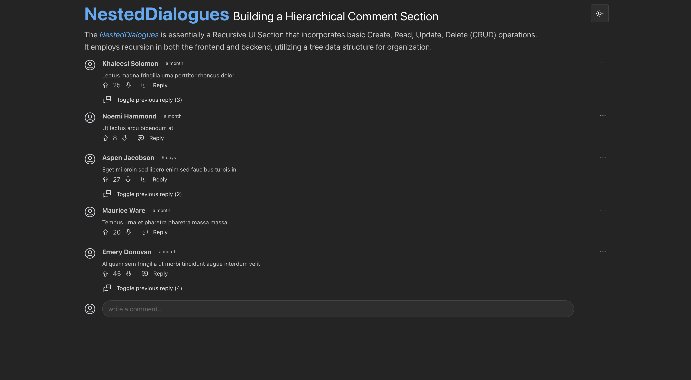

# Getting Started with Comment Tree

This project was bootstrapped with React Vite Typescript and Mantine

## Project Details

In this project, my aim was to demonstrate the application of the Tree Data Structure by creating a Recursive Component using React and TypeScript.

I embarked on designing a straightforward recursive comment section that leverages a tree data structure. This approach facilitates the organization of comments and their replies in a hierarchical fashion, enabling each comment to act as a parent to multiple replies. Such a setup mimics the nested comment systems observed on platforms like Reddit and various blogging websites, allowing for an intuitive user experience.

To streamline the development process and maintain a focus on the core functionality, I opted to utilize the Mantine UI Library. In my experience, it stands out as an exceptional UI library, offering comprehensive solutions right out of the box. I also incorporated both Dark and Light Mode features to enhance usability.

Given the rising popularity of Vite, I decided to integrate it into the project as well. The entire project is crafted in TypeScript, serving as a testament to my proficiency with the language.

## Available Scripts

In the project directory, you can run:

### `npm start`

Runs the app in the development mode.\
Open [http://localhost:3000](http://localhost:3000) to view it in the browser.

The page will reload if you make edits.\
You will also see any lint errors in the console.

### `npm run build`

Builds the app for production to the `build` folder.\
It correctly bundles React in production mode and optimizes the build for the best performance.

The build is minified and the filenames include the hashes.\
Your app is ready to be deployed!
